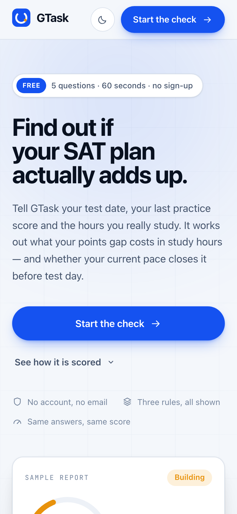
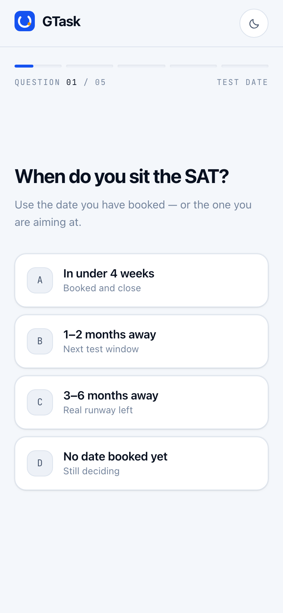
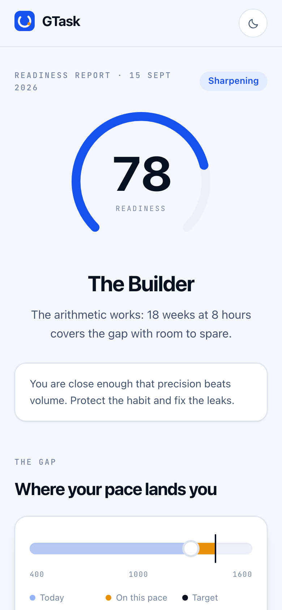

# GTask — SAT Readiness Check

Five questions, sixty seconds, one honest report. GTask measures the gap between the
score a student has today and the score their target university expects, converts that
gap into study hours, and says whether the current pace closes it before test day.

**The score is computed by rules, not by a model.** The same five answers always produce
the same report, and every step of the arithmetic is printed on the result page.

- **Live:** _see the deployment section below_
- **Stack:** Next.js 16 (App Router) · TypeScript · Tailwind v4 · Supabase · Vercel

<p align="center">
  
  
  
</p>

---

## How the scoring works

One calibration constant: **moving 100 SAT points costs roughly 45 study hours.**
Everything else is arithmetic on the student's own answers.

| Input | Where it comes from |
| --- | --- |
| `gap` | target score − last practice score |
| `requiredHours` | `gap × 0.45` |
| `budgetHours` | weeks to test day × hours studied per week |
| `projected` | baseline + `budgetHours ÷ 0.45`, capped at the target |

The readiness score out of 100 is three weighted components:

```
readiness = 40 × proximity + 38 × capacity + 22 × habit  ± modifiers

proximity = 1 − gap / 400                 how close the baseline already is
capacity  = budgetHours / requiredHours   does the time cover the work
habit     = hoursPerWeek / 10             is there a weekly rhythm
```

Modifiers: a pacing-only weakness adds 3, a weakness in both sections subtracts 5, and an
unmeasured baseline discounts the whole score by 10% (and assumes 1050).

Four bands follow from the score: **Foundation** (0–39), **Building** (40–64),
**Sharpening** (65–84), **Test-ready** (85–100). The archetype (“The Sprinter”, “The
Sleeper”, …) and the phased plan are rule tables over the same numbers —
see [`lib/readiness/engine.ts`](lib/readiness/engine.ts).

## Project layout

```
app/
  page.tsx            landing page
  check/              the five questions
  r/[id]/             a saved report, addressable and shareable
  actions.ts          server action: score, store, return the report id
lib/
  readiness/          the domain. questions, bands, engine, types, tests
  store/              save and read a submission (Supabase, memory fallback)
components/
  ui/                 buttons, icons, cards, theme toggle
  viz/                GapScale and ScoreDial
  landing/ check/ result/
supabase/schema.sql   the single table
```

`lib/readiness` has no React, no network and no environment in it — it is pure input to
output, which is why the whole rule set is covered by tests, including a sweep over all
400 possible answer combinations.

## Running it

```bash
npm install
npm run dev      # http://localhost:3000
npm test         # the rule engine
npm run lint
npm run build
```

Without Supabase credentials the app runs against an in-memory store, so a fresh clone
works with no setup.

## Storage

One table, `submissions`, created by [`supabase/schema.sql`](supabase/schema.sql). Each
row holds the five answers, the full report, and a few flattened columns so the Supabase
table view is readable. Row-level security is on and no anon policy is granted: writes
and reads go through the server with the service-role key, so nothing is readable from
the browser. No names, no emails, no accounts.

## Deploying

```bash
./deploy.sh       # guided: Supabase keys, Vercel env, production deploy
```

The wizard checks the connection with a real insert before deploying, so a green run
means the deployed site can actually write.

## Accessibility and mobile

Built mobile-first at 390px and up. Keyboard: `A`–`E` or `1`–`5` answer a question,
`Backspace` goes back. Every interactive element has a visible focus ring, motion honours
`prefers-reduced-motion`, and both themes are designed rather than inverted.
